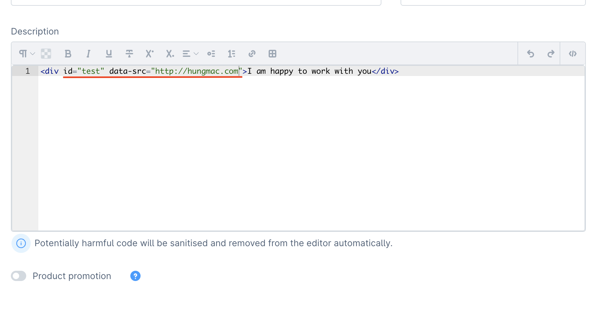

# MacDisabledSantizeHtml

   

This plugin disables the sanitizeHtml function in the backend. This is useful if you want to use the same editor as 6.4 to edit HTML code.

# Attention

I encourage to use and adaptation of the sanitizeHtml feature on shopware 6.5.
Removing the sanitizeHtml function is a security risk. Please only use this plugin if you know what you are doing.

# Installation

- Zip Installation package for the Shopware Plugin Manager
- Activation of the plugin and enjoy.

# How it works?

At the Shopware 6.4 this feature has `FEATURE_NEXT_15172` flag. This flag is removed in 6.5 to enabled the sanitizeHtml feature.

I disabled to the sanitizeHtml function in the backend by adding a `false` option.
You can see it in the file: `src/Resources/app/administration/src/app/asyncComponent/form/sw-code-editor/index.js` and make it disable in the AllowHtml flag, Because we can't make a decorated for this flag, I have to create a new file in this plugin: `custom/plugins/MacDisabledSantizeHtml/src/Decorator/AllowHtml.txt` and replace the original file with this file `vendor/shopware/core/Framework/DataAbstractionLayer/Field/Flag/AllowHtml.php`.

# About me
I am a former Shopware employee, and I am happy to help you if you have any questions. Just write me a message.
I am also open to work, if you are looking for an experienced developer contact me at hi@hungmac.com.
